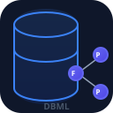

<div align="center">



# DBML Obsidian

**Database diagram designer for Obsidian**

[](https://www.apache.org/licenses/LICENSE-2.0)
[](https://www.typescriptlang.org/)
[](https://obsidian.md/)
[](https://codemirror.net/)
[](https://www.dbml.org/)
[]()

</div>

Design ER diagrams using [DBML](https://www.dbml.org/) syntax with live interactive preview — a native [dbdiagram.io](https://dbdiagram.io) alternative for Obsidian.

## Features

- **Code block support**: Use ` ```dbml ` blocks in Markdown notes — renders interactive diagrams inline
- **`.dbml` file editor**: Open `.dbml` files in a split view (code editor + interactive canvas)
- **Live preview**: Diagram updates as you type
- **Interactive canvas**: Drag tables, pan (scroll), zoom (Ctrl+scroll), highlight relationships
- **Smart edge routing**: Orthogonal lines with Q-curve corners and collision avoidance (outer routing)
- **Multi-select**: Drag-select tables, Shift+click, move groups, delete tables
- **Relationship creator**: Click columns on canvas to create Refs with cardinality picker (1:1, 1:N, N:1)
- **Crow's foot notation**: Proper cardinality markers (bar for "one", fan for "many")
- **Export**: PNG (4x quality), SVG, SQL (MySQL, PostgreSQL, SQL Server, Oracle)
- **Auto-layout**: BFS-based arrangement — most-connected tables at center, disconnected below
- **Table groups**: `TableGroup` visual containers with dashed borders
- **Syntax highlighting**: Atom-inspired theme synced with Obsidian theme
- **Dark/Light mode**: All colors adapt to Obsidian CSS variables
- **Persistent layout**: Table positions saved across sessions via plugin `data.json`

## Technology Stack

[](https://www.typescriptlang.org/)
[](https://docs.obsidian.md/)
[](https://github.com/holistics/dbml)
[](https://codemirror.net/)
[]()
[](https://esbuild.github.io/)

| Layer | Technology |
|-------|-----------|
| **Parser** | `@dbml/core` v8 — full DBML parsing |
| **Editor** | CodeMirror 6 with custom ViewPlugin-based syntax highlighter |
| **Canvas** | Pure SVG with viewport transform (pan/zoom) |
| **Build** | esbuild (single bundle ~15MB) |
| **Framework** | TypeScript + Obsidian Plugin API |
| **SQL Export** | `@dbml/core` exporter module |

## Installation

### From source
```bash
git clone https://github.com/user/dbml-obsidian.git
cd dbml-obsidian
npm install --legacy-peer-deps
npm run build
```

### Manual install
1. Copy `dist/main.js`, `dist/manifest.json`, `dist/styles.css` to your vault's `.obsidian/plugins/dbml-obsidian/`
2. Enable "DBML Obsidian" in Obsidian Settings → Community Plugins

### Development
```bash
npm run dev    # Watch mode + auto-copy to vault
npm run build  # Production build
```

Edit `esbuild.config.mjs` to change the vault output path.

## Usage

### Code blocks in Markdown
````markdown
```dbml
Table users { id integer [pk] }
Table posts { id integer [pk], user_id integer [ref: > users.id] }
```
````

### File-based editing
- Create `diagram.dbml` → auto-opens in DBML Obsidian split view
- Use `Ctrl+P` → "Create new DBML diagram"
- Click the database icon in the left ribbon

### Canvas interactions
| Action | Shortcut |
|--------|----------|
| **Pan vertical** | Scroll |
| **Pan horizontal** | Shift + scroll |
| **Zoom** | Ctrl + scroll |
| **Select tables** | Click / drag marquee / Shift+click |
| **Move tables** | Drag |
| **Pan canvas** | Ctrl + drag |
| **Delete tables** | Select → Delete key |
| **Add relation** | Click "Add Rel" → click source column → click target column → choose type |
| **Arrange** | Click "Arrange" in toolbar |
| **Zoom to table** | Double-click table |

## DBML Syntax Reference

```dbml
Table users {
  id integer [pk, increment]
  username varchar [not null, unique]
  email varchar [not null]
  created_at timestamp
}

Table posts {
  id integer [pk, increment]
  title varchar [not null]
  body text
  user_id integer [ref: > users.id]
}

// Relationships
Ref: posts.user_id > users.id       // N:1 (many-to-one)
Ref: users.id < follows.following_user_id  // 1:N (one-to-many)
Ref: a.id - b.a_id                  // 1:1 (one-to-one)

// Table groups
TableGroup auth_module { users, user_sessions }

// Enums
Enum status { active, inactive, pending }

// Custom header colors
Table users [headercolor: #6366F1] { ... }
```

## File Structure

```
src/
├── main.ts              # Plugin entry, ribbon, commands, settings
├── settings.ts          # Plugin settings & settings tab
├── model/
│   └── erd-model.ts     # TypeScript interfaces (ErdTable, ErdRelation, etc.)
├── parser/
│   └── dbml-parser.ts   # DBML normalizer + @dbml/core wrapper
├── diagram/
│   ├── layout.ts        # BFS auto-layout algorithm
│   └── erd-renderer.ts  # SVG canvas: tables, edges, interactivity
├── editor/
│   ├── editor.ts        # CodeMirror 6 setup with syntax highlighting
│   ├── dbml-language.ts # StreamLanguage parser for DBML
│   ├── autocomplete.ts  # DBML snippets
│   └── linting.ts       # @dbml/core linter
├── views/
│   ├── dbml-file-view.ts # TextFileView: split editor + canvas
│   ├── code-block.ts    # Markdown code block processor
│   └── rel-modal.ts     # Relationship creation modal (legacy)
└── export/
    └── exporter.ts      # SVG/PNG export with theme inlining
```

## 👤 Autor

<div align="center">
<br>
<b>Jesús Daniel Garizao Mejía</b>
<br><br>
  <a href="https://github.com/TheOfYisu">
    
  </a>
  &nbsp;
  <a href="https://www.instagram.com/theofyisu">
    
  </a>
</div>

## 🤖 Créditos

<div align="center">
  <p><b>Desarrollado con</b></p>
  <a href="https://github.com/anomalyco/opencode">
    
  </a>
  &nbsp;
  <a href="https://deepseek.com">
    
  </a>
  <br><br>
</div>

## 📄 Licencia
```
Copyright 2026 DBML Obsidian

Licensed under the Apache License, Version 2.0 (the "License");
you may not use this file except in compliance with the License.
You may obtain a copy of the License at

    http://www.apache.org/licenses/LICENSE-2.0

Unless required by applicable law or agreed to in writing, software
distributed under the License is distributed on an "AS IS" BASIS,
WITHOUT WARRANTIES OR CONDITIONS OF ANY KIND, either express or implied.
See the License for the specific language governing permissions and
limitations under the License.
```
